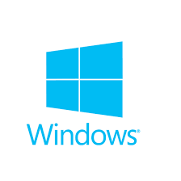

 http://lenguaje-latino.org/

### Instalar en Windows
1. Descargue el instalador
2. Ejecute el instalador

#### Nota:
Puede requerir el framework de C++, descarguelo desde la pagina oficial de Microsoft:
https://www.microsoft.com/es-ES/download/details.aspx?id=48145

###Documentacion (borrador)
1. https://robincoello.gitbooks.io/latino/content/inicio.html
2. http://lenguaje-latino.org/doc/index.php

### DESINSTALAR
Latino se desistala como cualquier otro programa

## Ayuda en nuestro foro 

http://lenguaje-latino.org/foro/windows/

####Cualquier aportación o sugerencia es bienvenida.
